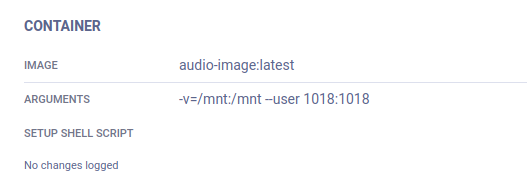

Workers & Queues in ClearML
===========================
## Queues
Есть возможность добавлять эксперименты в очередь (queue) и ставить очередь на исполнение (worker-ом).
1. Создать свою очередь (у каждого пользователя будет своя очередь). В интерфейсе во вкладке `Workers&Queues -> Queues -> "+ NEW QUEUE"`
<br/>
 
<br/>
2. Имея завершенный без ошибок эксперимент склонировать его и задать имя.

Склонированный эксперимент будет иметь статус **draft**. Эксперименты с таким статусом можно ставить в очередь на выполнение. 
<br/>
3. В draft эксперименте поменяем нужные параметры (args, hparams, docker args и др.)

Необходимо также заполнить поля конфигурации контейнера. Указать docker image и аргументы запуска, а именно `-v -w --user`. <br/>
ВАЖНО: GPU устанавливаются в другом месте <br/>


После чего ставим эксперимент в очередь на выполнение

<br/>
эксперимент, находящийся в очереди на выполнение имеет статус **pending**

## Workers
Worker является исполнителем экспериментов в данной очереди. У worker-а в распоряжении есть список доступных GPU. 

<br/>
Создать worker-а и указать для него очередь на выполнение можно двумя способами:
###  СПОСОБ 1
Создавать worker-а (исполнителя) каждый раз, передавая docker image и **номера GPU**
```
# delete previous worker
clearml-agent daemon --stop yakov_queue
# create new worker for queue "yakov_queue" with available GPU 0
clearml-agent daemon --queue yakov_queue --detached --docker yakov_image:latest --gpus 0
```
###  СПОСОБ 2
Создавать воркера (исполнителя) один раз, передав docker image и **все доступные GPU**
```
clearml-agent daemon --queue alex_queue --detached --docker alex_image:latest
``` 
А нужные GPU определять в скрипте train.py (или test.py)
```
python3 train.py --batch-size 100 ... --gpus 1,2
``` 
>ЗАМЕЧАНИЕ: таким способом можно изменять номера GPU в самом эксперименте (в графе args) и перезапускать обучение на других картах прям в интерфейсе - без консоли.
