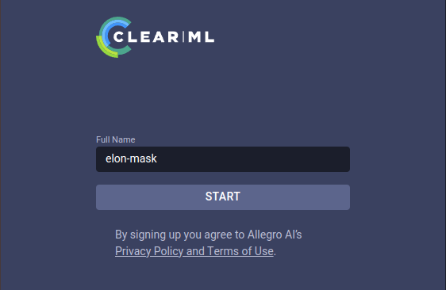
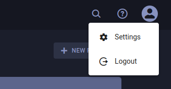
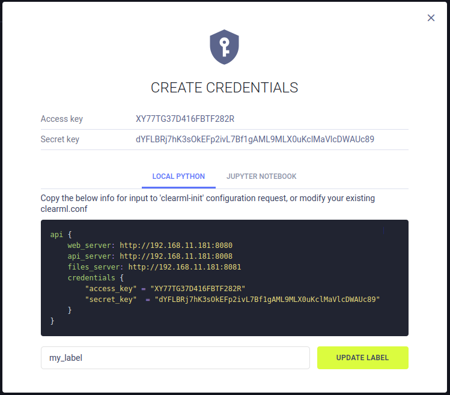
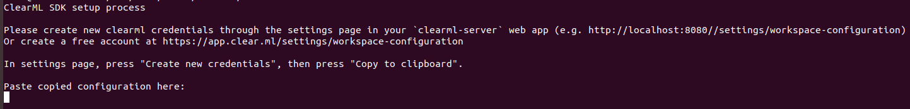
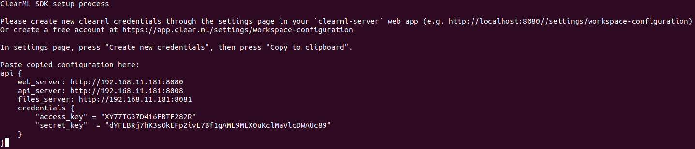

ClearML first experiment
========================
Пошаговый гайд по тому, как провести эксперимент, используя ClearML

1. Зайти в интерфейс (http://192.168.11.181:8080) и ввести имя, от которого будут проводиться ваши эксперименты. <br/>


2. В настройках пользователя (cправа в углу) <br/>

<br/>
перейти в вкладу workspace и "+ Create new credentials" <br/>

<br/>
Скопировать и сохранить данную конфигурацию (код)

### Следующие действия проводятся **в контейнере** разработки, где запускаются train.py и test.py
3. Установить библиотеку clearml
```
pip install clearml
```
4. Выполнить команду
```
cleaml-init
```
4.1. Если данная команда не сработает, проверить home директорию. Если такой директории нет, то в контейнере нужен user со своей директорией `/home/user/`. Как это сделать в контейнере, я писал отдельный пост "Добавление user в docker контейнер" в топике "System Administration". Повторить шаг (4)

5. После запуска команды (4) попросят скопировать конфигурацию из п.2

<br/>

<br/>
В результате в конце будет такой вывод:
```
Verifying credentials ...
Credentials verified!

New configuration stored in /home/user/clearml.conf
ClearML setup completed successfully.
```

6. Закоммитить docker image

7. Теперь можно использовать класс **ClearMLManager** из файла `manager.py`, предварительно установив в `config.yaml` **access_key** и **assess_token** из конфиурации п.2. Либо запустить следующие строки кода:
```python
Task.set_credentials(
    key='XY77TG37D416FBTF282R', 
    secret='dYFLBRj7hK3sOkEFp2ivL7Bf1gAML9MLX0uKclMaVlcDWAUc89'
)
task = Task.init(project_name='FaceRecognition/my-first-experiment', 
                 task_name='train-001', 
                 task_type=TaskTypes.training,
                 auto_connect_frameworks=False)
logger = Logger.current_logger()

task.add_tags(['example'])

hparams = {
    'learning_rate': 0.001
}
task.connect(hparams, name='hparams')

logger.report_scalar(
            title='Metrics', 
            series='Accuracy', 
            value=0.879, 
            iteration=1
)
```